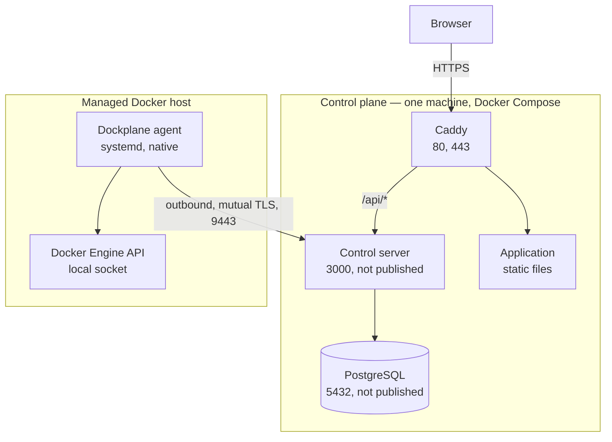

# Architecture

## Deployment

What a running Dockplane looks like. Every arrow is a connection something
opens; nothing reaches into a managed host.



The agent opens the connection to the gateway and keeps it open. The control
server sends capability requests down that existing connection; it never dials a
host. There is no SSH anywhere in this picture, and no port to open on a managed
host.

The gateway on 9443 terminates its own TLS and authenticates the agent's client
certificate. It is not proxied through Caddy — a proxy that terminated that TLS
would destroy the only thing the gateway authenticates.

## Overview

Dockplane is a distributed Docker management system composed of:

- a public marketing/documentation surface
- an authenticated web application
- a central control server
- PostgreSQL
- a lightweight agent installed on each managed Docker host

The control server coordinates identity, authorization, state and actions. Agents perform narrowly defined host-local Docker operations.

```text
┌────────────────────────────┐
│       Public Website       │
│  Angular / prerendered     │
└────────────────────────────┘

┌────────────────────────────┐
│    Dockplane Application   │
│    Angular + TailwindCSS   │
└─────────────┬──────────────┘
              │ HTTPS
              ▼
┌────────────────────────────┐
│    Dockplane Control API   │
│           NestJS           │
│                            │
│ Auth / RBAC / Audit        │
│ Inventory / Actions        │
│ Events / Agent Control     │
└─────────────┬──────────────┘
              │
              ├──────── PostgreSQL
              │
              │ authenticated persistent channel
              ▼
┌────────────────────────────┐
│       Dockplane Agent      │
│             Go             │
│                            │
│ Docker capabilities        │
│ Host inventory / metrics   │
└─────────────┬──────────────┘
              │
              ▼
         Docker Engine
```

## Design Goals

The properties the architecture is built for. Some are reached today and some
are direction; [Product Scope](../product/PRODUCT_SCOPE.md) and the features
page are where that line is drawn.

- centralized Docker visibility across multiple hosts
- no central storage of SSH passwords
- outbound-friendly agent connectivity
- explicit remote capabilities
- strong device identity
- resource-scoped user authorization
- auditable operations
- clear stale/offline state
- forward-compatible agent protocol

## Connectivity

Each agent opens the connection to the control server, so no public inbound
management port is required on a Docker host.

A dropped connection is retried with bounded exponential backoff and jitter, so
a control plane coming back does not meet a fleet reconnecting in lockstep.

## State

Dockplane distinguishes:

### Observed state
Latest state reported by an agent.

### Persisted inventory
Known host/workload metadata stored by the control server.

### Action state
Lifecycle of a requested operation.

### Ephemeral telemetry
Rapidly changing metrics with potentially shorter retention.

The UI must never present stale data as current without indication.

## Action Lifecycle

An action is authorized before it is recorded, so a request that fails
authorization never becomes one. From there it carries a status:

```text
queued
running
succeeded
failed
timed_out
cancelled
```

alongside the moments it was requested, started and completed. Every action
carries its own identifier, the capability it dispatched, the host and target it
names, the actor behind it, and the correlation ID that ties it to the audit
entry and to the request that started it.

## Core Domain

### User
Authenticated operator.

### Role
Named permission collection.

### Host
A managed Docker host.

### Agent
Device identity associated with a managed host.

### Container
A Docker container, discovered on a host or created by Dockplane.

### Compose Project
A Docker Compose workload discovered on a host. Read-only.

### Stack
A Compose configuration Dockplane holds, deployed to a host it names.

### Stack Revision
One saved version of a stack's configuration. Written once and never changed.

### Health Check
Configured or observed health state.

### Action
Authorized operational request.

### Event
Normalized operational event.

### Audit Entry
Security-relevant append-oriented record.

Host groups, images, networks, volumes and a higher-level service grouping are
in the product's direction and are not entities today. See
[Product Scope](../product/PRODUCT_SCOPE.md).

## Docker Integration

The agent reaches the local Docker Engine through the Engine API, using the
official Go SDK, and never through a shell.

The capability set is fixed at build time: reading a host and its containers,
running a container, creating, replacing and removing the containers Dockplane
made, streaming container output, discovering Compose projects, and deploying
and operating the stacks Dockplane deployed. A container or a stack Dockplane
removes takes no volume with it, and there is no capability that removes a
volume, a network or an image.

The full catalogue and what each capability returns are in
[Docker Integration](../integrations/docker.md).

## Compose

Compose is modeled as a first-class workload grouping.

Dockplane should preserve:
- project name
- host
- associated containers
- labels
- discovered configuration metadata where safely available
- current state

Do not assume every container belongs to Compose.

## Services

A service would be a Dockplane-level grouping of related workloads:

```text
Nextcloud
├── nextcloud
├── postgres
└── redis
```

It is direction rather than product. Nothing in this release groups workloads
above the stack and the Compose project.

## Storage

PostgreSQL holds the durable state:

- users, roles, permissions and sessions
- hosts, agents and enrollment records
- discovered containers and Compose projects
- stacks, their revisions and their environment
- the desired configuration of the containers Dockplane created
- actions, events and audit entries

Container output is not among them. Logs are read from the host when somebody
asks for them and are never written down here.

## Versioning

The REST API is versioned in its path. Four further numbers decide whether two
pieces of a deployment can work together: the agent protocol version, the
database schema version, the backup format version, and the version of the plan
a stack operation is sent as. `GET /api/v1/version` reports the server's build,
its protocol version and both schema versions without a session, because a
deployment has to be able to say what it is before anyone can sign in. See
[Interface Versions](interface-versions.md).

## Trust Boundaries

Primary boundaries:
1. browser ↔ control server
2. control server ↔ database
3. control server ↔ agent
4. agent ↔ Docker daemon
5. agent ↔ host OS

Docker daemon access is privileged and must be treated accordingly.

## Failure Modes

Expected:
- agent offline
- network partition
- Docker daemon unavailable
- workload disappears between list and action
- action timeout
- version mismatch
- revoked credential
- control server restart

Failures must result in deterministic states and useful operator messages.

## Public Website Separation

The public website should be independently deployable and should not depend on the authenticated Dockplane control server.

This:
- reduces public attack surface
- keeps product/docs pages available during control-plane maintenance
- allows static hosting/CDN use
- separates release concerns
